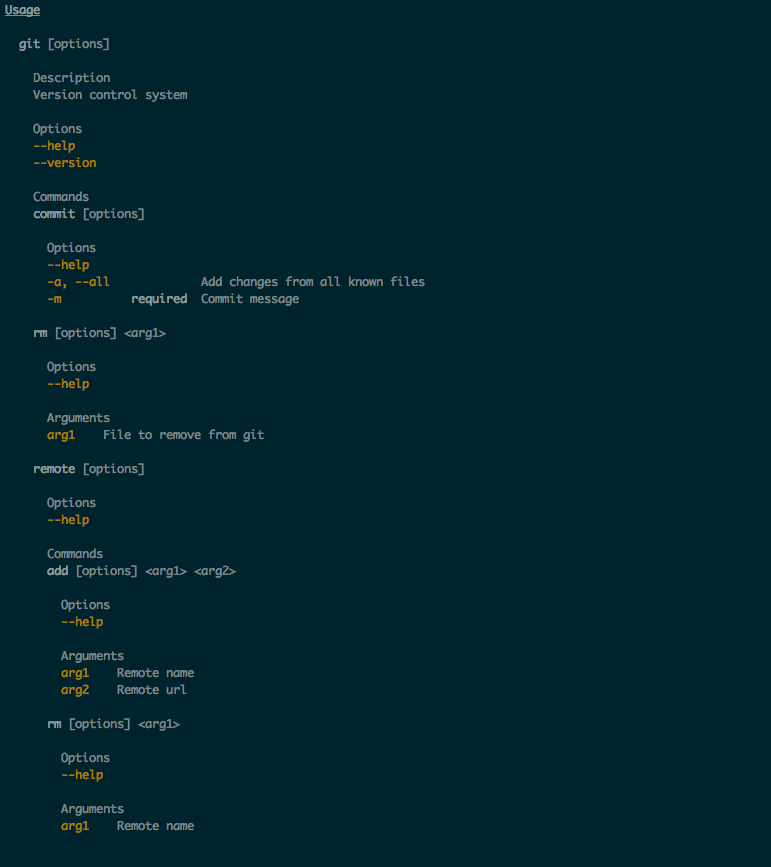

# FreeCLI

[](https://travis-ci.org/pavlosgi/freecli)
[](http://codecov.io/github/pavlosgi/freecli?branch=master)

### Overview

FreeCLI is another command line argument parsing library build using Free Applicative hence the name.

The library uses Cats and Shapeless at it's core. 

Here is a list of all of FreeCLI's modules:

 * `freecli-circe`: provides bindings for Circe
 * `freecli-core`: the core FreeCLI library, the types and type classes
 * `freecli-examples`: a few examples on how to use the library
 * `freecli-testkit`: testing helpers for testing the library

### Preview
Before diving in, this is what your CLI configuration will produce:



### Getting Started

To get started with SBT, simply add the following to your `build.sbt`
file:

```scala
libraryDependencies += "com.pavlosgi" %% "freecli-core" % "0.1.1"
```

If you require `circe` bindings then add the following:

```scala
libraryDependencies += "com.pavlosgi" %% "freecli-circe" % "0.1.1"
```

To get started in code you can use the following imports.

```scala
 import freecli.core.all._     // provides core operations
 import freecli.command.all._  // provides command operations
 import freecli.config.all._   // provides config operations
```

### Core 

##### Syntax
* `des` construct description
* `group[T]` group to generic T
* `groupT` group to tuple

### Arguments

Allows defining positional arguments

##### Syntax
* `string` argument of type String
* `int` argument of type Int
* `long` argument of type Long
* `bool` argument of type Boolean
* `file` argument of type java.io.File
* `existentFile` argument of type ExistentFile
* `newFile` argument of type NewFile
* `arg[T]` argument with type T
* `name` construct argument name
* `-~` modifier for optional configuration of the arguments

##### Parsing
* `parseArgument` will return a CliParser that will need to be `run` 
* `runArgumentOrFail` will return the value or fail printing the errors and help

##### Examples
```scala
import freecli.core.all._
import freecli.argument.all._
 
val dsl = string
val res: String = runArgumentOrFail(dsl)(Seq("one"))
 
val dsl2 = string -~ name("arg1")
val res2: String = runArgumentOrFail(dsl2)(Seq("one"))
 
val dsl3 = string -~ name("arg1") -~ des("argument description")
val res3: String =
  runArgumentOrFail(dsl3)(Seq("one"))
 
case class Arguments(arg1: String, arg2: Int)
val dsl4 =
  group[Arguments] {
    string ::
    int
  }
 
val res4: Arguments =
  runArgumentOrFail(dsl4)(Seq("one", "2"))
 
val dsl5 =
  groupT {
    string ::
    int
  }
 
val res5: (String, Int) =
  runArgumentOrFail(dsl5)(Seq("one", "2"))
```  

More examples can be found in [Argument tests](./core/src/test/scala/pavlosgi/freecli/argument/ArgumentDslTest.scala) and the [Argument example](./examples/src/main/scala/pavlosgi/freecli/examples/argument/DatabaseConfig.scala) that can be run as follows:

```
$ sbt
[info] Set current project to freecli-root (in build file:/Users/pavlos/Workspace/freecli/)
 
> project freecli-examples
[info] Set current project to freecli-examples (in build file:/Users/pavlos/Workspace/freecli/)
 
> run 8080 host username password database
[warn] Multiple main classes detected.  Run 'show discoveredMainClasses' to see the list
 
Multiple main classes detected, select one to run:
 
 [1] freecli.examples.argument.DatabaseConfig
 [2] freecli.examples.command.Git
 [3] freecli.examples.config.DatabaseConfig
 [4] freecli.examples.decoder.Decoder
 [5] freecli.examples.option.DatabaseConfig
 
Enter number: 1
 
[info] Running freecli.examples.arguments.DatabaseConfig 8080 host username password database
DatabaseConfig(8080,host,username,password,database)
[success] Total time: 22 s, completed 22-Jan-2017 23:52:26
```

#### Options

Allows defining named options

##### Syntax
* `string` option of type String
* `int` option of type Int
* `long` option of type Long
* `double` option of type Double
* `boolean` option of type Boolean
* `file` option of type File
* `existentFile` option of type ExistentFile 
* `newFile` option of type NewFile
* `flag` flag option
* `help` adds help option that prints help (does not appear in parsed type)
* `version` adds version option that prints the version (does not appear in parsed type)
* `value` adds the string value to display for version
* `opt[T]` option of type T
* `sub[T]` subset of options
* `subT(description: Description)` subset of options with description 
* `req` required option
* `or[T](default: T)` sets option default
* `--"name"` sets the name of the option 
* `-'a'` sets the name abbreviation of the option
* `-~` modifier for optional configuration of the options

##### Parsing
* `parseOption` will return a CliParser that will need to be `run` 
* `runOptionOrFail` will return the value or fail printing the errors and help

##### Examples
```scala
import freecli.core.all._
import freecli.option.all._
 
val dsl = string --"opt1"
val res: Option[String] =
runOptionOrFail(dsl)(Seq("--opt1", "one"))
 
val dsl2 = string --"opt1" -~ des("option description")
val res2: Option[String] =
runOptionOrFail(dsl2)(Seq("--opt1", "one"))
 
val dsl3 = string -'o'
val res3: Option[String] =
runOptionOrFail(dsl3)(Seq("-o", "one"))
 
val dsl4 = string -'o' -~ des("option description")
val res4: Option[String] =
runOptionOrFail(dsl4)(Seq("-o", "one"))
 
val dsl5 = string --"opt1" -'o'
val res5: Option[String] =
runOptionOrFail(dsl5)(Seq("--opt1", "one"))
 
val dsl6 = string --"opt1" -'o' -~ des("option description")
val res6: Option[String] =
runOptionOrFail(dsl6)(Seq("-o", "one"))
 
case class Options(
opt1: Option[String],
opt2: Int,
opt3: Int,
opt4: Boolean)
 
val dsl7 =
group[Options] {
  string  --"opt1"          ::
  int     --"opt2" -~ req   ::
  int     --"opt3" -~ or(1) ::
  flag    --"opt4" ::
  help    --"help" ::
  version --"version" -~ value("v1.0")
}
 
val res7: Options =
runOptionOrFail(dsl7)(
  Seq(
    "--opt1", "one",
    "--opt2", "two",
    "--opt3", "three",
    "--opt4"
  ))
 
val res7b: Options =
runOptionOrFail(dsl7)(
  Seq(
    "--opt2", "two",
    "--opt3", "three"))
```  

More examples can be found in [Option tests](./core/src/test/scala/pavlosgi/freecli/option/OptionDslTest.scala) and the [Option example](./examples/src/main/scala/pavlosgi/freecli/examples/option/DatabaseConfig.scala) that can be run as follows:

```
$ sbt
[info] Set current project to freecli-root (in build file:/Users/pavlos/Workspace/freecli/)
 
> project freecli-examples
[info] Set current project to freecli-examples (in build file:/Users/pavlos/Workspace/freecli/)
 
> run --port 8080 --host host --username username --password password --database database
[warn] Multiple main classes detected.  Run 'show discoveredMainClasses' to see the list
 
Multiple main classes detected, select one to run:
 
 [1] freecli.examples.argument.DatabaseConfig
 [2] freecli.examples.command.Git
 [3] freecli.examples.config.DatabaseConfig
 [4] freecli.examples.decoder.Decoder
 [5] freecli.examples.option.DatabaseConfig
 
Enter number: 5
 
[info] Running freecli.examples.options.DatabaseConfig --port 8080 --host host --username username --password password --database database
DatabaseConfig(8080,host,username,password,database)
[success] Total time: 22 s, completed 22-Jan-2017 23:52:26
```

#### Config

Config allows mixing options with arguments as long as the arguments come last. 

##### Syntax
The syntax for config re-exports Argument syntax and Option syntax and resolves the conflicts between them by namespacing Option with O for the following:
 
* `O.string`
* `O.int`
* `O.long`
* `O.double`
* `O.boolean`
* `O.file`
* `O.existentFile`
* `O.newFile`

##### Parsing
* `parseConfig` will return a CliParser that will need to be `run` 
* `runConfigOrFail` will return the value or fail printing the errors and help

##### Examples
```scala
import freecli.core.all._
import freecli.config.all._
 
val dsl = O.string --"opt1"
val res: Option[String] =
runConfigOrFail(dsl)(Seq("--opt1", "one"))
 
val dsl2 = O.string --"opt1" -~ des("option description")
val res2: Option[String] =
runConfigOrFail(dsl2)(Seq("--opt1", "one"))
 
val dsl3 = O.string -'o'
val res3: Option[String] =
runConfigOrFail(dsl3)(Seq("-o", "one"))
 
val dsl4 = O.string -'o' -~ des("option description")
val res4: Option[String] =
runConfigOrFail(dsl4)(Seq("-o", "one"))
 
val dsl5 = O.string --"opt1" -'o' -~ or ("1")
val res5: String =
runConfigOrFail(dsl5)(Seq("--opt1", "one"))
 
val dsl6 = O.string --"opt1" -'o' -~ req -~ des("option description")
val res6: String =
runConfigOrFail(dsl6)(Seq("--opt1", "one"))
 
case class Config(
opt1: Option[String],
opt2: Int,
opt3: Int,
opt4: Boolean,
arg1: String,
arg2: Int)
 
val dsl7 =
group[Config] {
  O.string --"opt1"          ::
  O.int    --"opt2" -~ req   ::
  O.int    --"opt3" -~ or(1) ::
  flag     --"opt4"          ::
  string                     ::
  int
}
 
val res7: Config =
runConfigOrFail(dsl7)(
  Seq(
   "--opt1", "one",
   "--opt2", "two",
   "--opt3", "three",
   "--opt4",
   "five",
   "six"))
```  

More examples can be found in [Config tests](./core/src/test/scala/pavlosgi/freecli/config/ConfigDslTest.scala) and the [Config example](./examples/src/main/scala/pavlosgi/freecli/examples/config/DatabaseConfig.scala) that can be run as follows:

```
$ sbt
[info] Set current project to freecli-root (in build file:/Users/pavlos/Workspace/freecli/)
 
> project freecli-examples
[info] Set current project to freecli-examples (in build file:/Users/pavlos/Workspace/freecli/)
 
> run --port 8080 -d -v host username password database
[warn] Multiple main classes detected.  Run 'show discoveredMainClasses' to see the list
 
Multiple main classes detected, select one to run:
 
 [1] freecli.examples.argument.DatabaseConfig
 [2] freecli.examples.command.Git
 [3] freecli.examples.config.DatabaseConfig
 [4] freecli.examples.decoder.Decoder
 [5] freecli.examples.option.DatabaseConfig
 
Enter number: 3
 
[info] Running freecli.examples.config.DatabaseConfig --port 8080 -d -v host username password database
DatabaseConfig(8080,true,true,host,username,password,database)
[success] Total time: 22 s, completed 22-Jan-2017 23:52:26
```

#### Command

Allows building commands or nested commands with configurations. When nesting commands
it's important to note that the run configuration of the nested command needs to be
the product of the parent configuration and the nested command configuration.

##### Syntax
* `cmd` construct a command
* `takes` add a config to the command
* `takesG[T]` add a config as T
* `takesT` add a config as a tuple
* `runs` specify parameterless function that executes when running the command
* `runs[T]` specify function that takes T and executes when running the command

##### Parsing
* `parseCommand` will return a CliParser that will need to be `run` 
* `runCommandOrFail` will return the value or fail printing the errors and help

##### Examples
```scala
import freecli.core.all._
import freecli.config.all._
import freecli.command.all._
 
case class Command1Config(opt1: Option[Int], opt2: String)
case class Command2Config(opt3: Int, arg1: String)
case class Command3Config(arg2: String)
 
val dsl =
cmd("command1") {
  takesG[Command1Config] {
    O.help   --"help" ::
    O.int    --"opt1" -~ des("opt1 description") ::
    O.string --"opt2" -~ req
  } ::
  cmd("command2") {
    takesG[Command2Config] {
      O.help --"help" ::
      O.int  --"opt3" -~ or(1) ::
      string -~ name("arg1")
    } ::
    runs[ParentWith[Command1Config, Command2Config]] { conf =>
      println(conf)
    }
  } ::
  cmd("command3") {
    takesG[Command3Config] {
      O.help --"help" ::
      string -~ name("arg2")
    } ::
    runs[ParentWith[Command1Config, Command3Config]] { conf =>
      println(conf)
    }
  }
}
 
val res: Unit =
runCommandOrFail(dsl)(
  Seq(
   "command1", "--opt1", "1", "opt2", "two",
     "command2", "--opt3", "3", "four")).run
 
/*
//Fails and prints errors and help for failing command
runCommandOrFail(dsl)(
Seq(
 "command1", "--opt1", "1", "opt2", "two",
   "command2", "--opt3", "3")).run
*/
```

More examples can be found in [Command tests](./core/src/test/scala/pavlosgi/freecli/command/CommandDslTest.scala) and the [Git example](./examples/src/main/scala/pavlosgi/freecli/examples/command/Git.scala) that can be run as follows:

```
$ sbt
[info] Set current project to freecli-root (in build file:/Users/pavlos/Workspace/freecli/)
 
> project freecli-examples
[info] Set current project to freecli-examples (in build file:/Users/pavlos/Workspace/freecli/)
 
> run git remote add origin git@github.com:pavlosgi/freecli.git
[warn] Multiple main classes detected.  Run 'show discoveredMainClasses' to see the list
 
Multiple main classes detected, select one to run:
 
 [1] freecli.examples.argument.DatabaseConfig
 [2] freecli.examples.command.Git
 [3] freecli.examples.config.DatabaseConfig
 [4] freecli.examples.decoder.Decoder
 [5] freecli.examples.option.DatabaseConfig
 
Enter number: 2
 
[info] Running freecli.examples.command.Git git remote add origin git@github.com:pavlosgi/freecli.git
Remote origin git@github.com:pavlosgi/freecli.git added
[success] Total time: 22 s, completed 22-Jan-2017 23:52:26
```

#### StringDecoder

You can define your own string decoder to parse custom types from the command line.

#### Examples
```scala
import cats.data.{Validated, ValidatedNel}
 
import freecli.argument.all._
import freecli.core.api.{StringDecoder, StringDecoderError}
 
sealed trait FooBar
case object Foo extends FooBar
case object Bar extends FooBar
 
implicit object fooBarStringDecoder extends StringDecoder[FooBar] {
  override def apply(value: String): ValidatedNel[StringDecoderError, FooBar] = {
    value match {
      case v if v.equalsIgnoreCase("Foo") => Validated.valid(Foo)
      case v if v.equalsIgnoreCase("Bar") => Validated.valid(Bar)
      case v =>
        Validated.invalidNel(StringDecoderError(s"$v did not match any of (Foo, Bar)"))
    }
  }
 
  override def toString(v: FooBar): String = {
    v match {
      case Foo => "Foo"
      case Bar => "Bar"
    }
  }
}
 
val x: FooBar = runArgumentOrFail(arg[FooBar])(Seq("Foo"))
```

More examples can be found in [StringDecoder](./core/src/main/scala/pavlosgi/freecli/core/api/StringDecoder.scala) and the [Decoder example](./examples/src/main/scala/pavlosgi/freecli/examples/decoder/Decoder.scala) that can be run as follows:

```
$ sbt
[info] Set current project to freecli-root (in build file:/Users/pavlos/Workspace/freecli/)
 
> project freecli-examples
[info] Set current project to freecli-examples (in build file:/Users/pavlos/Workspace/freecli/)
 
> run Apple
[warn] Multiple main classes detected.  Run 'show discoveredMainClasses' to see the list
 
Multiple main classes detected, select one to run:
 
 [1] freecli.examples.argument.DatabaseConfig
 [2] freecli.examples.command.Git
 [3] freecli.examples.config.DatabaseConfig
 [4] freecli.examples.decoder.Decoder
 [5] freecli.examples.option.DatabaseConfig
 
Enter number: 4
 
[info] Running freecli.examples.decoder.Decoder Apple
Apple
[success] Total time: 6 s, completed 22-Jan-2017 23:52:26
```

## License

freecli is licensed under the **[Apache License, Version 2.0][apache]** (the
"License"); you may not use this software except in compliance with the License.

Unless required by applicable law or agreed to in writing, software
distributed under the License is distributed on an "AS IS" BASIS,
WITHOUT WARRANTIES OR CONDITIONS OF ANY KIND, either express or implied.
See the License for the specific language governing permissions and
limitations under the License.

Copyright 2015-2017 Pavlos Georgiou

[apache]: http://www.apache.org/licenses/LICENSE-2.0